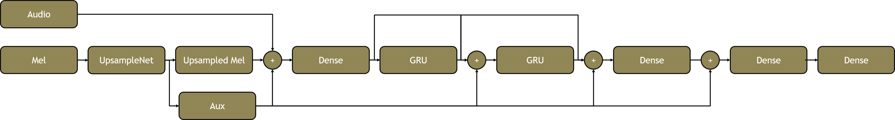
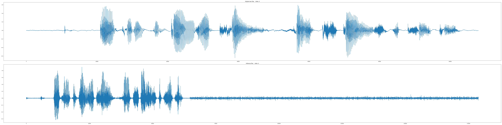
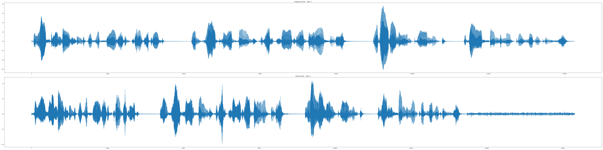
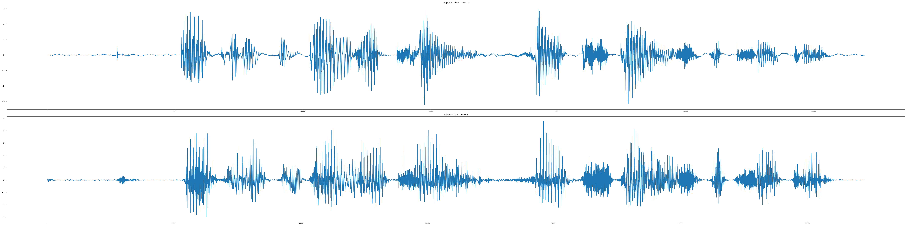
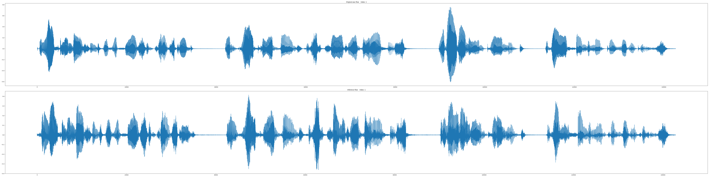

# WaveRNN in TF2

This code is an implementation of WaveRNN. The algorithm is based on the following paper:

```
Kalchbrenner, N., Elsen, E., Simonyan, K., Noury, S., Casagrande, N., Lockhart, E., ... & Kavukcuoglu, K. (2018). Efficient neural audio synthesis. arXiv preprint arXiv:1802.08435.
```

At the same time, I referred a lot of parts of modules from [fatchord's WaveRNN github](https://github.com/fatchord/WaveRNN).


# Requirements
Please see the 'requirements.txt'.

There is a critical part at [Modules.py](Modules.py#L214-L246). This part is different by the TF2 version because hidden state parameter must be a list until tensorflow 2.1. If you want to test this code at TF2.1, please modify this part.

# Structrue


# Used dataset
Currently uploaded code is compatible with the following datasets. The O mark to the left of the dataset name is the dataset actually used in the uploaded result. I did not train the multi speakers yet.

```
[O] LJSpeech: https://keithito.com/LJ-Speech-Dataset/
[X] VCTK: https://datashare.is.ed.ac.uk/handle/10283/2651
[X] LibriSpeech: http://www.robots.ox.ac.uk/~vgg/data/voxceleb/
[X] TIMIT: http://academictorrents.com/details/34e2b78745138186976cbc27939b1b34d18bd5b3
[X] Blizzard Challenge 2013: http://www.cstr.ed.ac.uk/projects/blizzard/
[X] FastVox: http://www.festvox.org/cmu_arctic/index.html
```

# Hyper parameters
Before proceeding, please set the pattern, inference, and checkpoint paths in 'Hyper_Parameter.json' according to your environment.

* Sound
    * Setting basic sound parameters.

* WaveRNN
    * Setting the parameters of WaveRNN.
    * There are two modes to export samples: Raw and MoL.
        * Raw is the paper based. Model train about two distribution: coarse and fine.
        * MoL is Parallel WaveNet based. Please see the detail at the following paper:

        ```
        Oord, A. V. D., Li, Y., Babuschkin, I., Simonyan, K., Vinyals, O., Kavukcuoglu, K., ... & Casagrande, N. (2017). Parallel wavenet: Fast high-fidelity speech synthesis. arXiv preprint arXiv:1711.10433.
        Salimans, T., Karpathy, A., Chen, X., & Kingma, D. P. (2017). Pixelcnn++: Improving the pixelcnn with discretized logistic mixture likelihood and other modifications. arXiv preprint arXiv:1701.05517.
        ```
    * In upsample, the product of all of upsample scales must be same to frame shift size of sound.
   

* Train
    * Setting the parameters of training.
    * Wav length must be a multiple of frame shift size of sound.
    
* Use_Mixed_Precision
    * __Currently, when this option is true, Nan loss occurs. I don't recommend use this option.__ 
    * Setting the usage of mixed precision.
    * If using, the tensors are stored by 16bit, not 32bit.
    * The weights are stored by 32bit, so the model is compatible with checkpoints learned with different mixed precisions if the rest of the parameters are the same.
    * Usually, this parameter makes be possible to use larger batch size.
    * In the unsupported machine, the speed is extreamly slower.
    * When using, I recommend to increase the epsilon of ADAM to 1e-4 to prevent the underflow problem.
    * See the following reference for details.
        * https://www.tensorflow.org/api_docs/python/tf/keras/mixed_precision/experimental/Policy
    

* Inference_Path
    * Setting the inference path
* Checkpoint_Path
    * Setting the checkpoint path
* Device
    * Setting which GPU device is used in multi-GPU enviornment.
    * Or, if using only CPU, please set '-1'.

# Generate pattern

## Command
```
python Pattern_Generate.py [parameters]
```

## Parameters

At least, one or more of datasets must be used.

* -lj <path>
    * Set the path of LJSpeech. LJSpeech's patterns are generated.
* -vctk <path>
    * Set the path of VCTK. VCTK's patterns are generated.
* -ls <path>
    * Set the path of LibriSpeech. LibriSpeech's patterns are generated.
* -timit <path>
    * Set the path of TIMIT. TIMIT's patterns are generated.
* -bc2013 <path>
    * Set the path of Blizzard Challenge 2013. Blizzard Challenge 2013's patterns are generated.
* -fv <path>
    * Set the path of FastVox. FastVox's patterns are generated.
* -mc
    * Ignore patterns that exceed the set number of each dataset.
* -mw
    * The number of threads used to create the pattern
    
# Inference file path while training for verification.

* Inference_Wav_for_Training.txt
    * Wav path which is used for inference while training.

# Run

## Command
```
python Model.py
```
    
# Inference

1. Run 'ipython' in the model's directory.
2. Run following command:
```
from Model import WaveRNN
new_WaveRNN = WaveRNN(is_Training= False)
new_WaveRNN.Restore()
```
3. There are two ways to insert mels.
    1. Insert a list of Mel patterns. Each mel's type and shape must be numpy array and '[Time, Mel_dim]'.
    ```
    mel_List = [mel1, mel2, mel3, ...]
    ```
    2. Insert a path of wav files.
    ```
    path_List = [
        './Wav_for_Inference/FV.AWB.arctic_a0001.wav'
        './Wav_for_Inference/FV.JMK.arctic_a0004.wav'
        './Wav_for_Inference/FV.SLT.arctic_a0007.wav'
        './Wav_for_Inference/LJ.LJ050-0278.wav'
        ]
    ```
4. Run following command:
```
new_WaveRNN.Inference(
    mel_List= None,
    wav_List= None,
    label= None,
    split_Mel_Window= 7,
    overlap_Window= 1,
    batch_Size= 16
    )
```
* Parameters
    * `mel_List and wav_List`
        * The list you set at section 3.
    * `label`
        * A label of inferenced file.
        * If None, the datetime is assigned.
    * `split_Mel_Window`
        * Mel length calculated as a single sequence.
        * The higher the value, the higher the quality but slower the inference.
    * `overlap_Window`
        * The length of the part to be calculated by overlapping the previous sequence in the divided mel.
        * The larger this value, the less the quality degradation during deployment.
    * `batch_Size`
        * Decide how many split mel sequences to calculate at one time.
        * Larger is faster, but it can cause out of memory problems.

# Result

* The following results are based on the checkpoint of 208500 steps of 32 batchs (509.31 epochs).
* Single talker (LJSpeech) is trained.
* The result is based on the original wav file. The joint with the voice synthesizer has not been progressed yet.
* Voice quality is not perfect, and I don't think additional training improve the quality.


* Full sequence (No split batch)
    * Trained wav
        * [NB_Wav_IDX_0](./Example_Results/Wav/20200330.195615.NB.IDX_0.WAV)
        * 
    * Unseen talker's wav
        * [NB_Wav_IDX_1](./Example_Results/Wav/20200330.195615.NB.IDX_1.WAV)
        * 

* Full sequence (No split batch)
    * Trained wav
        * [Batched_Wav_IDX_0](./Example_Results/Wav/20200330.195606.Batched.IDX_0.WAV)
        * 
    * Unseen talker's wav
        * [Batched_Wav_IDX_1](./Example_Results/Wav/20200330.195606.Batched.IDX_1.WAV)
        * 

# Trained checkpoint

[Checkpoint here](./Example_Results/Checkpoint/Checkpoint.zip)

* This is the checkpoint of 208500 steps of 32 batchs (509.31 epochs).
* Single talker (LJSpeech) is trained.

# Future works
1. Improving quality.
    * Parameter change?
    * Structure modification?

2. Mutil speaker. There are two ways.
    * Without any speaker information
    * Append speaker ID 

3. Integrating GST Tacotron
    * https://github.com/CODEJIN/GST_Tacotron    